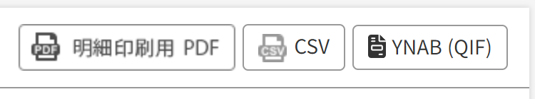
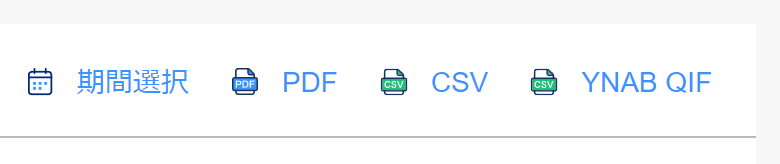
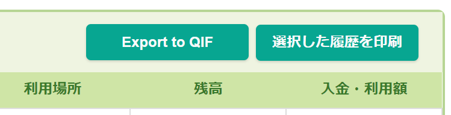

# ynab-userscripts

Userscripts to extract transaction data into
[QIF (Quicken Interchange Format)](https://en.wikipedia.org/wiki/Quicken_Interchange_Format),
a format for transmitting transaction data usable by YNAB and most other
accounting software.

Scripts always add an extra button that needs to be clicked to perform the
export, and the exports are done entirely client-side by reading the contents of
the webpage. No data is sent anywhere[^1].

[^1]: the Rakuten Card script works by postprocessing the content produced by
Rakuten's own CSV export, so a `fetch` request for the CSV is done. The network
request is identical to clicking the CSV button yourself.

## Rakuten Card

Parses the very confusing CSV format, cleans the Payee field noise and produces
an easily imported QIF file.

Transactions converted to revolving are generated as two transactions; one is
the original (or as much of it as was able to be recovered), another is a
transaction with payee set to `Converted to Revolving` "adding back" the value
that the original spent. This is intended to be combined with YNAB's Loan
Account system, and `Converted to Revolving` transactions should be set up to be
autocategorized as `Transfer`s _from_ the Loan (or tracking) Account.

Transactions entered as installments should generate a split for the installment
fee, but this is untested.

[Install Userscript](https://github.com/Jessidhia/ynab-userscripts/releases/latest/download/rakuten_card.user.js)

## PayPay Bank (née Japan Net Bank)

Generates a QIF export of the transactions in the account statement.

May require that the Debit Card statement be browsed to in order to correlate
payees in transactions older than 2022; newer transactions should not require it.
I do not have a Credit Card with them so that is untested / unsupported.

[Install Userscript](https://github.com/Jessidhia/ynab-userscripts/releases/latest/download/jnb.user.js)

## Mobile Suica (with experimental Pasmo support)

Generates a QIF export of the transactions in the SF利用履歴. Unlike the stock
Print button, this ignores the checkmarks and exports everything that is
visible.

No transactions other than transit fares are annotated in any way in the
statement, so it is better to do manual input of any non-train-related
transactions and use this export just for reconciliation, lest you have to
recall what/where was it that you spent ¥151 two weeks ago.

However, the transactions to enter or exit a train station are very nicely
detailed so the entry/exit station names are exported as the transaction memo.
The payee defaults to `Suica Transport` in this case for autocategorization. I
don't know if buses also get this treatment.

Transactions that add cash to the card are also handled and the payee is always
prefixed with `Charge`.

[Install Userscript](https://github.com/Jessidhia/ynab-userscripts/releases/latest/download/suica.user.js)
